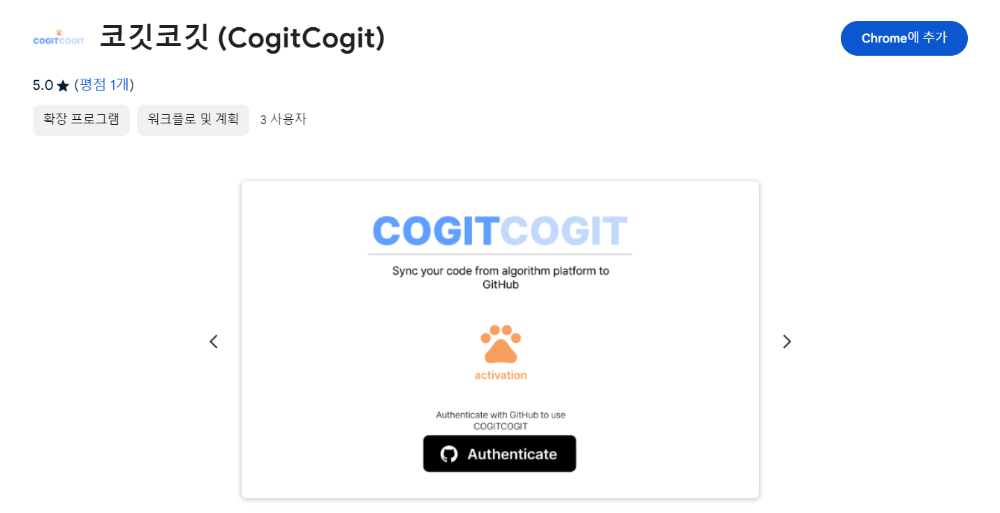
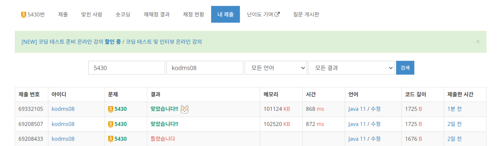
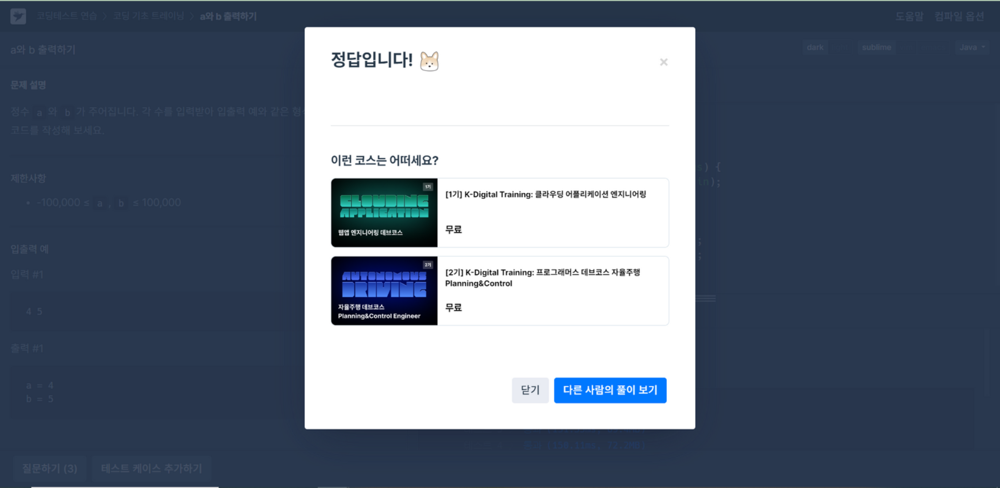
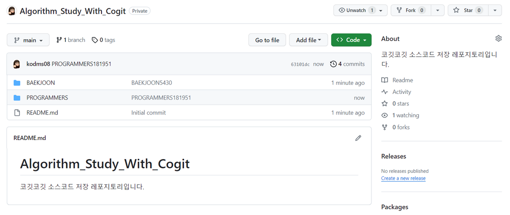
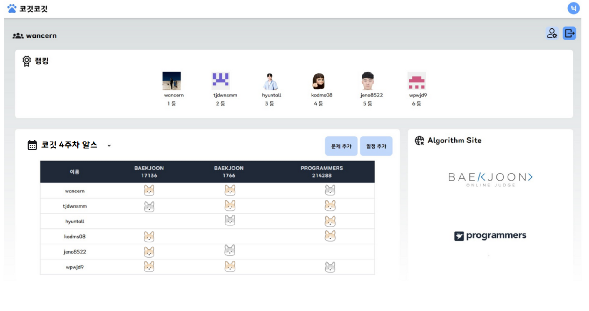
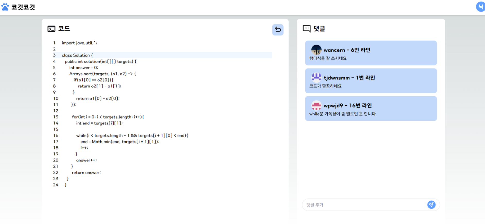
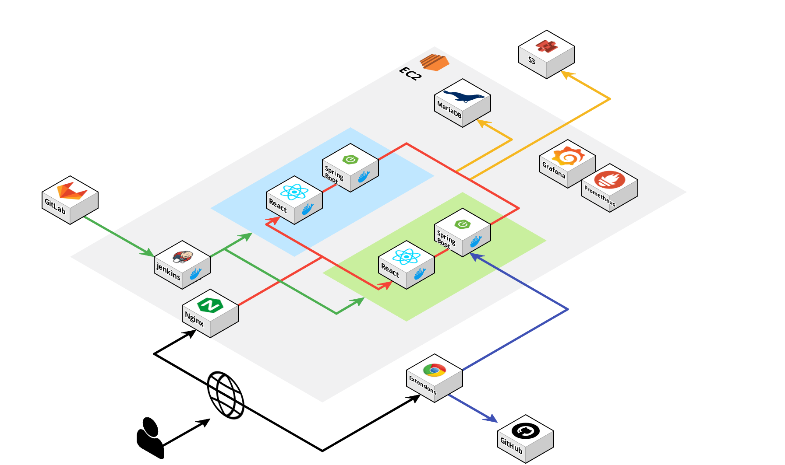
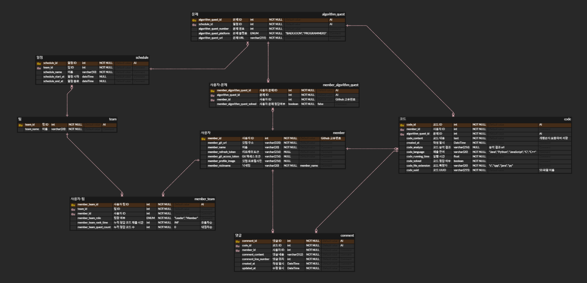

# 리드미

# CogitCogit

<div align="center">
  
</div>

## 📖목차
- CogitCogit
  - [프로젝트 진행 기간](#프로젝트-진행-기간)
  - [❤ 팀 소개](#-팀-소개)
    - [팀명](#팀명)
    - [팀원 소개](#팀원-소개)
    - [Frontend](#frontend)
    - [Backend](#backend)
  - [🎉 프로젝트 요약](#-프로젝트-요약)
  - [✨주요 기능 및 구현](#주요-기능-및-구현)
  - [🖥 서비스 화면](#-서비스-화면)
  - [🏗️ 아키텍쳐](#%EF%B8%8F-아키텍쳐)
  - [🛠 기술 스택](#-기술-스택)
  - [📝 설계 문서](#-설계-문서)
    - [ERD](#erd)
    - [API](#api)
    - [FIGMA](#figma)
- [💻 구동 방법](#-구동-방법)

---

## 프로젝트 진행 기간

`2023.10.7 ~ 2023.11.17 (약 7주)`

---

## ❤ 팀 소개

<!--  -->

### 팀명

> 📢 하얀마음 109 (A109)

### 팀원 소개

### Frontend

|                                                                               |                                                                               |
| ----------------------------------------------------------------------------- | ----------------------------------------------------------------------------- |
| <br>이현구 | <br>연제정 |

---

### Backend

|                                                                               |                                                                               |                                                                               |
| ----------------------------------------------------------------------------- | ----------------------------------------------------------------------------- | ----------------------------------------------------------------------------- |
| <br>박성준 | <br>박현철 | <br>임하은 |

---

### Infra

|                                                                               |
| ----------------------------------------------------------------------------- |
| <br>주창훈 |

---

## 🎉 프로젝트 요약

💡 **프로젝트 명**: 코깃코깃

**목적**: 알고리즘 스터디와 코드 관리를 간편하게 관리하고 싶다.

**기대효과**:

- 알고리즘 스터디 일정과 멤버 관리를 보다 간편하게 진행할 수 있다.
- 서로간의 코드를 더 명확하게 리뷰할 수 있다.

---

## ✨주요 기능 및 구현

💡 **계정**: Github 소셜 로그인을 통해 계정을 등록한다.

💡 **스터디**: 팀원을 관리하고 모든 일정을 한 번에 달력으로 볼 수 있다.

💡 **일정**: 문제를 등록하고 팀원들의 문제 풀이 현황을 보며 코드 리뷰를 할 수 있다.

💡 **크롬 익스텐션**: 백준 및 프로그래머스 문제 풀이 GitHub 자동 push

---

## 🖥 서비스 화면

<summary>크롬 익스텐션 팝업</summary>
<div markdown="1">

</div>

<summary>백준/프로그래머스 문제 업로드</summary>
<div markdown="1">
<br>

</div>

<summary>GitHub repository 생성</summary>
<div markdown="1">

</div>

<summary>내 스터디 일정 확인</summary>
<div markdown="1">

</div>

<summary>그룹 페이지</summary>

<div markdown="1">

</div>

<summary>코드 리뷰</summary>
<div markdown="1">

</div>

---

## 🏗️ 아키텍쳐



---

## 🛠 기술 스택

<div align=center>
<!-- 백엔드 -->


<!-- 데이터베이스 -->


<!-- 프론트엔드 -->


<!-- 인프라 -->


</div>

---

## 📝 설계 문서

### ERD

<details>
<summary>ERD</summary>
<div markdown="1">


</div>
</details>

### API

<details>
<summary>명세서</summary>
<div markdown="1">
 <a href="https://catkin-guavaberry-869.notion.site/API-98969d042c874cc892619ecc8790d98e?pvs=4" target="_blank">명세서 바로가기</a>
</div>
</details>

### FIGMA

<details>
<summary>WIREFRAME</summary>
<div markdown="1">
 <a href="https://www.figma.com/file/j3zorOkIVlNpTmWenfy45g/%EC%BD%94%EA%B9%83%EC%BD%94%EA%B9%83?type=design&node-id=0%3A1&mode=design&t=EV5s3nS99N0bbhKa-1" target="_blank">피그마 바로가기</a>
</div>
</details>

---

## 💻 구동 방법

```markdown
1. Clone Project
```

git clone https://lab.ssafy.com/s09-final/S09P31A109.git

```

2. change path to /Frontend

```

npm i

```
3. create .env file

```

# .env.development

NEXT_PUBLIC_API=http://localhost:8080
NEXT_PUBLIC_GITHUB_CLIENT_ID={YOUR_GITHUB_CLIENT_ID}
NEXT_PUBLIC_GITHUB_SECRET_KEY={YOUR_GITHUB_SECRET_KEY}

# .env.production

NEXT_PUBLIC_API=http://cogit.kr/api
NEXT_PUBLIC_GITHUB_CLIENT_ID={YOUR_GITHUB_CLIENT_ID}
NEXT_PUBLIC_GITHUB_SECRET_KEY={YOUR_GITHUB_SECRET_KEY}

```
4. frontend start

```

npm start

```
5. change path to /Backend/src/main/resources

```

create env.yml

MARIADB_DATABASE_URL: {YOUR_MARIADB_URL}
DATABASE_USERNAME: {YOUR_MARIADB_USERNAME}
DATABASE_PASSWORD: {YOUR_MARIADB_PASSWORD}
GITHUB_CLIENT_ID: {YOUR_GITHUB_CLIENT_ID}
GITHUB_CLIENT_SECRET: {YOUR_GITHUB_CLIENT_SECRET}
ACCESS_TOKEN_VALID_TIME: {YOUR_ACCESS_TOKEN_VALID_TIME}
JWT_KEY_SIZE_BITS: {YOUR_JWT_KEY_SIZE_BITS}
JWT_SECRET_KEY: {YOUR_JWT_SECRET_KEY}
REFRESH_TOKEN_VALID_TIME: {YOUR_REFRESH_TOKEN_VALID_TIME}
S3_BUCKET: {YOUR_S3_BUCKET_NAME}
S3_ACCESS_KEY: {YOUR_S3_ACCESS_KEY}
S3_SECRET_KEY: {YOUR_S3_SECRET_KEY}

```
6. Run CogitApplication
```

[포팅메뉴얼 참조](https://catkin-guavaberry-869.notion.site/95c158f533524339838daf0d8c9392ed?pvs=4)

---
